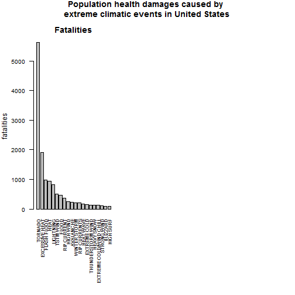

# Introduction

The instruction of the homework are: Your Shiny Application

1. Write a shiny application with associated supporting documentation. The documentation should be thought of as whatever a user will need to get started using your application.
2. Deploy the application on Rstudio's shiny server
3. Share the application link by pasting it into the text box below
4. Share your server.R and ui.R code on github

The application must include the following:

1. Some form of input (widget: textbox, radio button, checkbox, ...)
2. Some operation on the ui input in sever.R
3. Some reactive output displayed as a result of server calculations
4. You must also include enough documentation so that a novice user could use your application.
5. The documentation should be at the Shiny website itself. Do not post to an external link.

The data ser tha i choose is from Storm Data base, that we used in another coursera course. 

---

## Used code


```r
library(plyr)
library(knitr)
library(ggplot2)
library(grid)
library(car)

StormData <- read.csv("C:/Users/Itahisa/Documents/repdata-data-StormData.csv", stringsAsFactors = FALSE, strip.white=TRUE, header=TRUE)                                        

StormData <- StormData[ , c("EVTYPE", "BGN_DATE", "FATALITIES", "INJURIES", "PROPDMG", "PROPDMGEXP", "CROPDMG", "CROPDMGEXP")]
str(StormData)  
```

```
## 'data.frame':	902297 obs. of  8 variables:
##  $ EVTYPE    : chr  "TORNADO" "TORNADO" "TORNADO" "TORNADO" ...
##  $ BGN_DATE  : chr  "4/18/1950 0:00:00" "4/18/1950 0:00:00" "2/20/1951 0:00:00" "6/8/1951 0:00:00" ...
##  $ FATALITIES: num  0 0 0 0 0 0 0 0 1 0 ...
##  $ INJURIES  : num  15 0 2 2 2 6 1 0 14 0 ...
##  $ PROPDMG   : num  25 2.5 25 2.5 2.5 2.5 2.5 2.5 25 25 ...
##  $ PROPDMGEXP: chr  "K" "K" "K" "K" ...
##  $ CROPDMG   : num  0 0 0 0 0 0 0 0 0 0 ...
##  $ CROPDMGEXP: chr  "" "" "" "" ...
```

```r
StormData$BGN_DATE <- as.POSIXct(StormData$BGN_DATE,format="%m/%d/%Y %H:%M:%S")

StormData$PROPDMGEXP <- factor(tolower(StormData$PROPDMGEXP))
StormData$CROPDMGEXP <- factor(tolower(StormData$CROPDMGEXP))

require(car)
require(plyr)

StormData$PROPDMGEXP <- as.numeric(recode(as.character(StormData$PROPDMGEXP), 
                                          "'0'=1;'1'=10;'2'=10^2;'3'=10^3;'4'=10^4;'5'=10^5;'6'=10^6;'7'=10^7;'8'=10^8;'b'=10^9;'h'=10^2;'k'=10^3;'m'=10^6;'-'=0;'?'=0;'+'=0"))

StormData$CROPDMGEXP <- as.numeric(recode(as.character(StormData$CROPDMGEXP), 
                                          "'0'=1;'1'=10;'2'=10^2;'3'=10^3;'4'=10^4;'5'=10^5;'6'=10^6;'7'=10^7;'8'=10^8;'b'=10^9;'h'=10^2;'k'=10^3;'m'=10^6;'-'=0;'?'=0;'+'=0"))

StormData$PROPDMGDOLLAR <- StormData$PROPDMG * StormData$PROPDMGEXP

StormData$CROPDMGDOLLAR <- StormData$CROPDMG * StormData$CROPDMGEXP

StormDataAgg <- ddply(StormData, ~EVTYPE, summarise, FATALITIES = sum(FATALITIES), 
                      INJURIES = sum(INJURIES), PROPDMG = sum(PROPDMGDOLLAR), CROPDMG = sum(CROPDMGDOLLAR))

Fatalities <- StormDataAgg[order(StormDataAgg$FATALITIES, decreasing = T), c("EVTYPE", 
                                                                             "FATALITIES")][1:20, ]
Injuries <- StormDataAgg[order(StormDataAgg$INJURIES, decreasing = T), c("EVTYPE", 
                                                                         "INJURIES")][1:20, ]
Propdmg <- StormDataAgg[order(StormDataAgg$PROPDMG, decreasing = T), c("EVTYPE", 
                                                                       "PROPDMG")][1:20, ]
Cropdmg <- StormDataAgg[order(StormDataAgg$CROPDMG, decreasing = T), c("EVTYPE", 
                                                                       "CROPDMG")][1:20, ]
```

---

# Plot


```r
par(mfrow = c(1, 2), oma = c(0, 0, 2, 0))
par(mar = c(10, 4, 3, 4))
barplot(Fatalities$FATALITIES, names.arg = Fatalities$EVTYPE, main = "Fatalities", 
        ylab = "fatalities", cex.axis = 0.8, cex.names = 0.7, las = 2)

title("Population health damages caused by \nextreme climatic events in United States", 
      outer = TRUE)
```

 


---

# Thanks for your attention


